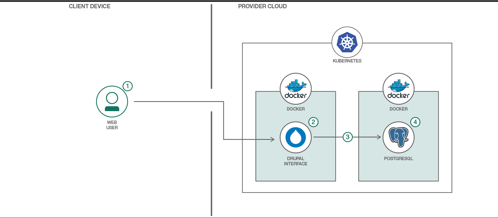

[](https://travis-ci.org/IBM/drupal-on-kubernetes-sample)

# Deploy Drupal on Kubernetes

In this Code Pattern, we will setup a Drupal site using Kubernetes and Postgres. Drupal is a popular free and open source content management system used as the backend for millions of web sites worldwide. By splitting out the services into containers, we have the ability to leverage the power of Kubernetes.

When the reader has completed this Code Pattern, they will understand how to:

* Configure an app running multiple containers in Kubernetes
* Run a website hosted via Kubernetes
* Use Kubernetes persistent volumes to maintain Drupal configurations between container restarts



## Flow

1. User interacts with the Drupal web interface.
2. The Drupal container uses its persistent volume to store website data (but not content).
3. Drupal container connects to PostgreSQL container to access website content.
4. PostgreSQL container uses its persistent volume to store the database contents.

## Included components

* [Kubernetes Cluster](https://console.bluemix.net/docs/containers/container_index.html): Create and manage your own cloud infrastructure and use Kubernetes as your container orchestration engine.
* [PostgreSQL](https://www.postgresql.org/): Sophisticated open-source Object-Relational DBMS supporting almost all SQL constructs.

## Featured technologies

* [Cloud](https://www.ibm.com/developerworks/learn/cloud/): Accessing computer and information technology resources through the Internet.

## Watch the video

[](https://youtu.be/fQY8q6CjU68)

## Steps

[](https://bluemix.net/deploy?repository=https://github.com/IBM/drupal-on-kubernetes-sample)

Follow these steps to run Drupal on Kubernetes.

1. [Clone the repo](#1-clone-the-repo)
2. [Create Kubernetes cluster](#2-create-the-kubernetes-cluster)
   1. [Locally](#2.1-locally)
   2. [Hosted on IBM Cloud](#2.2-hosted-on-ibm-cloud)
3. [Create the service and deployment](#3-create-the-service-and-deployment)
4. [Access Drupal](#4-access-drupal)

### 1. Clone the repo

Clone the `drupal-on-kubernetes-sample` locally. In a terminal, run:

```
$ git clone https://github.com/IBM/drupal-on-kubernetes-sample
```

### 2. Create Kubernetes cluster

Note: Minimum version 1.10 is required for both Kubernetes server and kubectl client.

#### 2.1 Locally

Follow the instructions for [running Kubernetes locally via Minikube](https://kubernetes.io/docs/getting-started-guides/minikube/).

#### 2.2 Hosted on IBM Cloud
Follow the instructions for [creating a Kubernetes cluster in IBM Cloud](https://console.bluemix.net/docs/containers/container_index.html#clusters).

### 3. Create the service and deployment

Either run ['scripts/quickstart.sh'](scripts/quickstart.sh), or run the individual commands listed in it:

```shell
kubectl create -f kubernetes/local-volumes.yaml
kubectl create -f kubernetes/postgres.yaml
kubectl create -f kubernetes/drupal.yaml
```

### 4. Access Drupal

After deploying, we need to be sure that all pods are running. Check on the status via:

```shell
kubectl get pods -l app=drupal
```

Once all pod are running we need to know the IP adress of our Drupal.

If you are running in Minikube, run the following:

```shell
$ minikube service drupal --url
```

If you are running in IBM Cloud, we will need to run the following:

```shell
$ bx cs workers "$CLUSTER_NAME"
OK
ID                                                 Public IP        Private IP      Machine Type   State    Status
kube-dal13-cr896f6348d71b4fd1ba151bc7c32abd46-w1   <REDACTED>       10.187.85.198   free           normal   Ready
```

Access the newly deployed Drupal site via http://<IP_ADDRESS>:30080

## Learn more

* **Kubernetes on IBM Cloud**: Deliver your apps with the combined the power of [Kubernetes and Docker on IBM Cloud](https://www.ibm.com/cloud-computing/bluemix/containers)

## License
This code pattern is licensed under the Apache Software License, Version 2.  Separate third party code objects invoked within this code pattern are licensed by their respective providers pursuant to their own separate licenses. Contributions are subject to the [Developer Certificate of Origin, Version 1.1 (DCO)](https://developercertificate.org/) and the [Apache Software License, Version 2](http://www.apache.org/licenses/LICENSE-2.0.txt).

[Apache Software License (ASL) FAQ](http://www.apache.org/foundation/license-faq.html#WhatDoesItMEAN)
